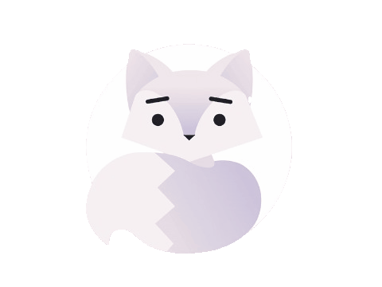

  

<i>✨ Remember where you started. ✨</i>

  

### 

<h2 align="center">Hey! I'm Tanjiro! </h2>

I'm a <b>Software Engineer pivoting into ML/NLP</b>, driven by curiosity and a passion for building smart systems.
 
I’m currently dedicating my time to <b>building my first portfolio</b>.

 

### 

<h3 align="left">🛠 Language and tools</h3>
 

  
  
  
  
  
  
  
  
  
  
  
  
  
  
  
  
  
  
  

 

###

<h3 align="left">👾 Stats</h3>
 

  

  

 

###

  
  
  
  
  

###

  

